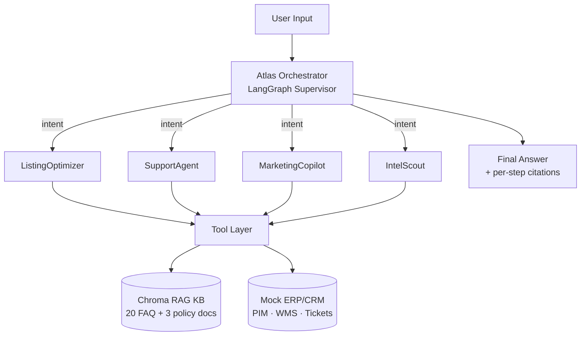

# Atlas Mercator

> **Multi-Agent Control Plane for Cross-Border E-Commerce — LangChain + Claude + RAG + ERP/CRM-Style Tool Integration.**
> **跨境电商多 Agent 调度中枢 — LangChain + Claude + RAG + ERP/CRM 风格工具集成**

<p align="center">
  <a href="README.md">🇬🇧 English</a> · <a href="README.zh-CN.md">🇨🇳 中文</a>
</p>

[](LICENSE)
[](https://www.python.org/)
[](https://python.langchain.com/)
[](https://www.anthropic.com/)
[](https://github.com/astral-sh/ruff)
[](tests/)
[](https://github.com/hhdhh/atlas-mercator/releases/tag/v0.1.0)

**Atlas Mercator** is a production-style multi-agent system that turns cross-border
e-commerce operations — listing optimization, customer support, marketing copy,
competitive intelligence — into orchestrated, tool-using LLM workflows with
explicit ReAct reasoning and RAG over an ERP/CRM-shaped knowledge base.

> _Mercator_ (Gerardus Mercator, 1512–1594) drew the world's first flat global
> map. _Atlas_ carried it on his shoulders. Together: the agent that **carries
> your global commerce plan into execution**.

---

## ✨ What It Does

| Capability | Agent | Tools | Business Outcome |
|---|---|---|---|
| Listing Optimization | `ListingOptimizer` | `search_products`, `translate_listing`, `keyword_research`, `search_kb` | Localized Amazon/eBay listings in 5 segments + backend keywords + compliance checks |
| Customer Support (RAG) | `SupportAgent` | `search_kb`, `get_order`, `create_ticket` | Cited answers, intent classification, auto-ticket escalation |
| Marketing Copy | `MarketingCopilot` | `keyword_research`, `translate_listing` | 3 A/B variants per channel/audience with rationale |
| Competitive Intel | `IntelScout` | `fetch_competitor_page`, `keyword_research` | Price/sentiment/differentiator digest from competitor URLs |
| **Orchestration** | `AtlasOrchestrator` (LangGraph Supervisor) | All of the above | THOUGHT → PLAN → EXECUTE → SYNTHESIZE across sub-agents |

Two pre-baked end-to-end workflows:

- **`new_market_launch`** — intel scout → listing optimizer → translate to 3 locales → keyword backfill
- **`customer_escalation`** — RAG diagnose → policy cite → ticket creation → resolution script

---

## 🏗️ Architecture



See [`docs/architecture.md`](docs/architecture.md) for the full data-flow.

---

## 🚀 Quick Start

```bash
# 1. Clone & install
git clone https://github.com/<your-username>/atlas-mercator
cd atlas-mercator
uv pip install -e ".[dev]"     # or:  pip install -e ".[dev]"

# 2. Configure secrets
cp .env.example .env
# Edit .env and set ANTHROPIC_API_KEY (or use the MiniMax proxy)

# 3. Seed mock data + build the RAG index
python scripts/seed_data.py
python scripts/build_kb_index.py

# 4. Launch the Gradio demo
python -m atlas_mercator.web.gradio_app
# → open http://localhost:7860
```

---

## 🧪 5-Minute Demo

1. Open the **Atlas Orchestrator** tab.
2. Click the **🆕 New Market Launch** preset button.
3. Watch the token stream + tool-call trace table update in real time.
4. Open the **Knowledge Base** tab to see which policy / FAQ chunks were retrieved.
5. Repeat with the **🆘 Customer Escalation** preset.

---

## 🎯 JD Keyword → Project Mapping

This project was designed to be a drop-in portfolio piece for AI Agent engineer roles.
Every JD requirement maps to a concrete module:

| JD Requirement | Where It Lives |
|---|---|
| Multi-step reasoning | `src/atlas_mercator/orchestrator/graph.py` + `prompts/orchestrator.py` |
| Tool calling | `src/atlas_mercator/tools/*.py` (7 Pydantic-typed tools) |
| Agentic Workflow MVP | `src/atlas_mercator/orchestrator/workflows.py` |
| ERP/CRM integration | `src/atlas_mercator/tools/product_tools.py` + `support_tools.py` (mock layer) |
| Prompt Engineering | `src/atlas_mercator/prompts/` (5 templated system prompts) |
| RAG | `src/atlas_mercator/rag/` (Chroma + sentence-transformers) |
| Python / LangChain | `langchain-core 0.3` + `langgraph` + `pydantic v2` |
| Gradio Web Demo | `src/atlas_mercator/web/gradio_app.py` (6 tabs) |

---

## 🧱 Project Structure

```
atlas-mercator/
├── src/atlas_mercator/
│   ├── config.py              # pydantic Settings
│   ├── llm/client.py          # ChatAnthropic factory
│   ├── schemas/               # Product, Order, Intent, ToolCall
│   ├── tools/                 # 7 Pydantic-typed tools
│   ├── rag/                   # Chroma indexer + retriever
│   ├── agents/                # 4 sub-agents + BaseAgent
│   ├── orchestrator/          # LangGraph supervisor + workflows
│   ├── prompts/               # 5 system prompt templates
│   ├── observability/         # tracer + sanitizer
│   └── web/gradio_app.py      # 6-tab demo
├── data/                      # mock products / FAQ / policies / orders
├── tests/                     # pytest suite
├── docs/                      # architecture, agent design, roadmap
└── scripts/                   # seed_data, build_kb_index, run_demo
```

---

## 🛣️ Roadmap

See [`docs/roadmap.md`](docs/roadmap.md). Highlights:

- **v0.2** — LangSmith tracing, tool-call retry backoff
- **v0.3** — Real Shopify / 1688 connectors
- **v0.4** — MCP server exposure
- **v0.5** — Hugging Face Spaces deployment

---

## 📄 License

[MIT](LICENSE)

---

## 中文版

请看 [README.zh-CN.md](README.zh-CN.md)。
