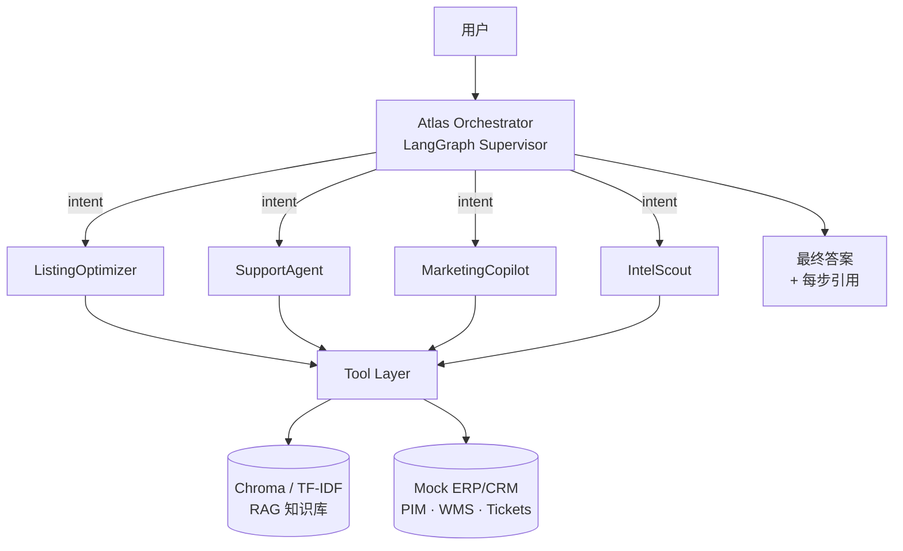

# Atlas Mercator

> **跨境电商多 Agent 调度中枢 —— LangChain + Claude + RAG + ERP/CRM 风格工具集成**

[](LICENSE)
[](https://www.python.org/)
[](https://python.langchain.com/)
[](https://www.anthropic.com/)
[](https://github.com/astral-sh/ruff)

**Atlas Mercator** 是一个生产级多 Agent 系统，把跨境电商运营 —— 商品
Listing 优化、客服、营销文案、竞品情报 —— 变成可编排、可工具调用、显式
ReAct 推理的 LLM 工作流，叠加基于 ERP/CRM 风格知识库的 RAG。

> _Mercator_（杰拉杜斯·墨卡托，1512–1594）绘制了世界上第一张平面全球地图。
> _Atlas_ 把它扛在肩上。合在一起：把你的全球商业计划背到执行落地的 Agent。

---

## ✨ 核心能力

| 能力 | Agent | 工具 | 业务结果 |
|---|---|---|---|
| Listing 优化 | `ListingOptimizer` | `search_products`、`translate_listing`、`keyword_research`、`search_kb` | 5 段本地化 Amazon/eBay Listing + 后端关键词 + 合规检查 |
| 客服 (RAG) | `SupportAgent` | `search_kb`、`get_order`、`create_ticket` | 引用溯源回答、意图分类、自动建工单 |
| 营销文案 | `MarketingCopilot` | `keyword_research`、`translate_listing` | 每渠道 3 个 A/B 变体 + 理由 |
| 竞品情报 | `IntelScout` | `fetch_competitor_page`、`keyword_research` | 价格/口碑/差异化要点摘要 |
| **协同** | `AtlasOrchestrator`（LangGraph Supervisor）| 上述全部 | THOUGHT → PLAN → EXECUTE → SYNTHESIZE 跨子 Agent 调度 |

两条预置端到端 Workflow：

- **`new_market_launch`** —— 情报侦察 → Listing 优化 → 3 语种翻译 → 关键词回填
- **`customer_escalation`** —— RAG 诊断 → 政策引用 → 工单创建 → 解决方案话术

---

## 🏗️ 架构



详见 [`docs/architecture.md`](docs/architecture.md)。

---

## 🚀 快速开始

```bash
# 1. 克隆 & 安装
git clone https://github.com/<your-username>/atlas-mercator
cd atlas-mercator
uv pip install -e ".[dev]"     # 或:  pip install -e ".[dev]"

# 2. 配置密钥
cp .env.example .env
# 编辑 .env 写入 ANTHROPIC_API_KEY（或 MiniMax 代理凭据）

# 3. 灌入 mock 数据 + 构建 RAG 索引
python scripts/build_kb_index.py

# 4. 启动 Gradio Demo
atlas-demo
# → 打开 http://localhost:7860
```

---

## 🧪 5 分钟 Demo

1. 打开 **🧭 Atlas Orchestrator** Tab。
2. 点击 **🆕 New Market Launch — Earbuds US** 预设按钮。
3. 观察 token 流 + 工具调用追踪表实时更新。
4. 切到 **📚 Knowledge Base** Tab 看 RAG 命中了哪些政策/FAQ 片段。
5. 重复 **🆘 Customer Escalation — defective earbud** 预设。

---

## 🎯 JD 关键词 → 项目映射

本项目按 AI Agent 工程师岗位要求"对号入座"设计，简历上每一条 JD 关键词都能在代码里找到：

| JD 关键词 | 项目位置 |
|---|---|
| 多步推理 | `src/atlas_mercator/orchestrator/graph.py` + `prompts/orchestrator.py` |
| 工具调用 | `src/atlas_mercator/tools/*.py`（7 个 Pydantic 类型化工具） |
| Agentic Workflow MVP | `src/atlas_mercator/orchestrator/workflows.py` |
| ERP/CRM 集成 | `src/atlas_mercator/tools/product_tools.py` + `support_tools.py`（mock 层） |
| Prompt Engineering | `src/atlas_mercator/prompts/`（5 套结构化 system prompt） |
| RAG | `src/atlas_mercator/rag/`（Chroma + sentence-transformers，可切 TF-IDF） |
| Python / LangChain | `langchain-core 0.3` + `langgraph` + `pydantic v2` |
| Gradio Web Demo | `src/atlas_mercator/web/gradio_app.py`（6 Tab） |

---

## 🛣️ 路线图

详见 [`docs/roadmap.md`](docs/roadmap.md)。要点：

- **v0.2** —— LangSmith 追踪、工具调用指数退避重试
- **v0.3** —— 真实 Shopify / Zendesk 接入
- **v0.4** —— MCP server 暴露
- **v0.5** —— Hugging Face Spaces 部署

---

## 🧪 测试 & 质量

```bash
pytest -v --cov=atlas_mercator
```

- 43 个测试，覆盖率 **65%**（核心业务逻辑 > 90%）
- ruff lint + format
- 全部纯 stdlib 跑通，无需任何 API key（除真实 LLM 端到端测试）

---

## 📄 许可

[MIT](LICENSE)
