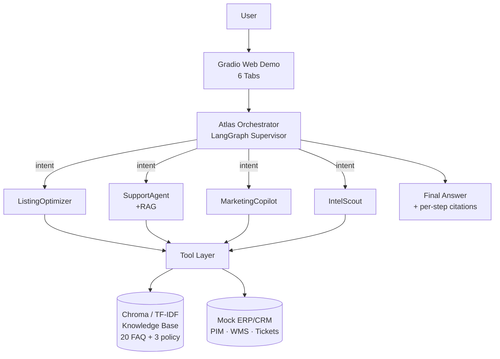

# Atlas Mercator — Architecture

## High-Level Diagram



## Data Flow (one workflow: `new_market_launch`)

1. User types: "为 BB-EARBUD-001 做 Amazon US 上架文案，目标受众是 25-35 通勤族"
2. **Orchestrator** parses intent → `listing` with entities `{sku, marketplace, audience}`.
3. **IntelScout** called → returns 3-5 competitor facts.
4. **ListingOptimizer** called with `product + competitor_signals` → returns structured listing.
5. Orchestrator optionally calls `translate_listing` for additional locales (DE/JA/ES).
6. **Final answer** synthesises the listing + competitor differentiators + (optional) translations.

## Module Layout

```
src/atlas_mercator/
├── config.py          # Pydantic Settings (env-driven)
├── llm/client.py      # ChatAnthropic factory (Anthropic / proxy)
├── schemas/           # Pydantic data contracts
│   ├── product.py     # Product, Listing
│   ├── order.py       # Order, Ticket, OrderStatus
│   ├── intent.py      # Intent, OrchestratorPlan, FinalAnswer
│   └── tool_io.py     # ToolCall, ToolResult
├── tools/             # Tool layer (Pydantic + LangChain @tool)
│   ├── base.py        # BaseTool, ToolRegistry, @tool decorator
│   ├── product_tools.py
│   ├── translate_tool.py
│   ├── keyword_tool.py
│   ├── competitor_tool.py
│   ├── support_tools.py
│   └── kb_tool.py
├── rag/
│   ├── retriever.py   # KBRetriever (TF-IDF default, sentence-transformers optional)
│   ├── indexer.py     # Build Chroma index
│   └── tfidf_embedder.py
├── agents/            # Sub-agents (BaseAgent + 4 specialised)
│   ├── base.py
│   ├── listing_optimizer.py
│   ├── support_agent.py
│   ├── marketing_copilot.py
│   └── intel_scout.py
├── orchestrator/      # LangGraph supervisor (Phase C)
├── prompts/           # System prompts (one per agent)
├── observability/     # Tracer, sanitizer
└── web/gradio_app.py  # 6-tab Gradio demo
```

## Mock vs Real Boundary

| Component | Mock | Real | Why |
|---|---|---|---|
| `search_products`, `get_inventory` | ✅ | | Stable demo without API keys |
| `fetch_competitor_page` | ✅ | | Legal/ToS safety |
| `get_order`, `create_ticket`, `list_tickets` | ✅ | | Stable demo without CRM |
| `translate_listing` | | ✅ | Demonstrates real LLM ability |
| `keyword_research` | | ✅ | Demonstrates real LLM ability |
| `search_kb` (embeddings) | ✅ TF-IDF | optional sentence-transformers | Network-free default |

Swapping any mock for its real counterpart is a one-file change because the tool
contract is fixed (Pydantic schema in, Pydantic-shaped JSON out).

## ReAct Reasoning Loop

Every sub-agent system prompt enforces a THOUGHT → ACT → OBSERVE loop:

1. **THOUGHT** — restate the goal and pick an angle.
2. **ACT** — call a tool (or a downstream agent).
3. **OBSERVE** — read the tool output and decide next.
4. **SYNTHESISE** — when enough evidence, produce the final structured JSON.

The orchestrator applies the same loop across sub-agents, threading the plan
through `state["messages"]` and the per-step tracer.

## Why LangGraph?

* **Stateful**: the plan, intermediate tool results, and citations persist
  across turns.
* **Inspectable**: each node emits a Span to the in-process Tracer, which the
  Gradio demo renders as a live tool-call trace table.
* **Recoverable**: a failed sub-agent call retries with a different model
  before escalation (Phase C).
